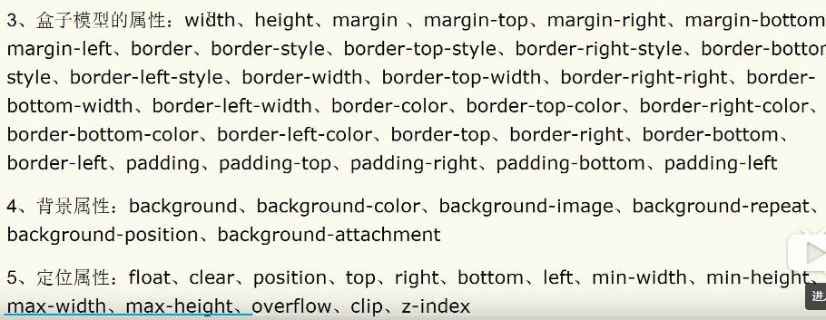
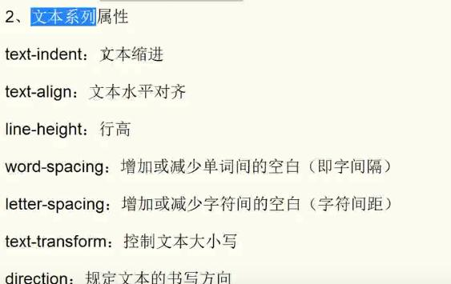

# HTML
## 块级标签和行内标签的特点?
独占一行和不独占一行可以区分

块级元素 table dl dt dd div h1-h6 hr ul li p nav form
- 与布局相关的大都属于块级 
- 从上往下排列
- 可以设置宽高以及盒子模型的其他属性
- 不设置宽高的情况下 他的宽度是父元素的宽度 高度是本身内容的高度
- 天生自带display：block；
- 块级元素可以嵌套行内元素
- ulol下面只能是li dl下面只能是dt dd
- p里面不能嵌套任何的块级元素 包括他自己本身

行内元素 a img span button em i input select strong b small sub sup textarea
- 与文字相关的大都属于行内 
- 从左往右排列
- 设置宽高不起作用 如果要起作用 需要转换为块、行内块
- 不设置宽高就是他本身的宽高
- 天生自带display：inline；
- 行内元素里不能嵌套块级元素（特殊a）
- a标签不能嵌套a标签 即使嵌套了 浏览器也会解析为并列的两个a

行内块元素
img input

## 标签语义化
选用合适的标签做合适的事情 例如文章段落用p标签 标题用h1-h6标签
标签语义化为浏览器和搜索引擎服务

1. 利于Seo优化（搜索引擎的爬虫依赖于标记来确定上下文和各个关键字的权重）
2. 在样式丢失的时候 还可以比较好的呈现结构
3. 更好的支持各种终端 例如无障碍阅读和有声小说
4. 利于团队开发和维护 W3C给我们定了一个标准 团队都遵循这个标准的话 代码的差异就会缩小 在开发和维护的时候就可以提高效率

**日常工作怎么遵循标签语义化**
1. 尽量减少使用无意义的标签 例如div
2. 尽量不适用标签本身的css属性 例如 b s font 需要样式的时候 使用css添加
3. 在强调的部分使用strong和em但是样式尽量使用css来描述
4. 表格搭建时 使用thead表格头部tbody表格身体tfoot表格尾部
5. 列表搭建时 使用ul无语列表和ol有序列表dl定义列表

## 面试题
- 利用border实现三角形效果?
- 一个元素如何在另一个元素中始终水平垂直居中?
- 如何让元素消失在视野中,发挥想象力?
- 多个元素在一行显示的方法?
- 三栏布局, 左定右定中间自适应的实现方法
- 行内元素和块级元素分别有什么?区别是什么?
# css
css规则由两个主要部分组成 选择器 以及一条或者多条声明
## 选择器
### 基本选择器
- 标签选择器:直接使用元素标签进行选择
- 类选择器:通过元素的类名 来选择元素
- id选择器 通过元素的id名来选择元素 类名是元素id属性中的属性值
- 通配符选择器 通过*选择全部元素 包括根元素
### 并集选择器
样式相同的标签可以并列在一起设置样式 标签名用逗号隔开
### 交集选择器
两种属性同属一个元素的时候 我们可以使用交集选择器来进行元素的准确选择 标签名以点连接
### 后代选择器
通过依据元素在其位置的上下文关系来定义样式 用空格隔开
### 子代选择器
与后代选择器相比 子元素选择器只能选择作为某元素子元素的元素 以大于号相连 
### 相邻兄弟选择器 +
相邻兄弟选择器课选择紧接在另一元素后的元素 且两者都有相同父元素     
加号前面的选择器只是用来作为我们查找兄弟的参照标签 她不参与样式的影响   
\+ 相邻兄弟    
~ 所有的兄弟
### 属性选择器
对带有指定属性的html元素设置样式  
[属性名="属性值"]{
	
   }
### 伪类选择器
:link 未访问的链接  
:visited 已访问的链接  
:hover 鼠标移动到连接上  
:active 选定的链接  
:focus 获取光标  
:blur 失去焦点  
css3新增伪类选择器  
:not(:last-child) 排除 最后一个元素排除某些属性
:last-child 最后一个子元素
:nth-child(n) 表示具体的第几个 odd/2n+1奇数 even /2n偶数	  
:only-child 唯一的元素  
:nth-last-child(n) 倒数第几个元素  
:first-of-type 第一个同级兄弟元素  
:last-of-type 最后一个同级兄弟元素  
:only-of-type 只有一个同级兄弟元素(自己)
:nth-of-type(n) 第几个同级兄弟元素  
:nth-last-of-type(n) 倒数第几个兄弟元素  
:empty 空内容的元素  
:checked 被选中 用在input表单元素中 
### 伪元素选择器
:first-letter 向文本的第一个字母添加特殊样式
:first-line 向文本的首行添加特殊样式
:before 在元素之前添加内容
:after 在元素之后添加内容
## css权重
- 一个行内样式+100
- 一个id+100
- 一个属性选择器/class类名/伪类+10
- 一个元素名/伪元素+1
- 相同的权重 以后面出现的选择器为最后规则
- 不同的权重权重值高则生效
## css中可以继承和不可以继承的属性
1. 无继承的属性  
  
  
  

2. 有继承性的属性  
  
  
  

## 盒子模型
从里到外:  
width height----padding----border-----margin  
### 盒子模型的宽和高
~~~
/**
 * 宽度和高度的单位
 1. px 像素 写死的单位
 2. % 百分比 动态计算的单位(自适应 响应式)
 */
~~~
### 盒子模型的内边距padding
~~~
/**
 * 上---右---下---左
 */
~~~
### 盒子模型的边框 border
~~~
边框线类型:
border-width
border-style
border-color
solid 实现
dashed 虚线
dotted 点状线

去掉边框线 border:0;
如果border属性只有边框宽度 没有边框类型和颜色 导致border属性失效

箭头制作:
/**
 * 三角箭头原理:正方形的任意相邻的两条边线
 * 然后旋转一定的角度 得到我们需要的任意方向的箭头
 * 三角形的大小由正方形的宽高去控制
 * 小三角的粗细由border边框线的宽度去控制
 */
.arrow{
	width:200px;
	height:200px;
	border-top:10px solid #000;
	border-left:10px solid #000;
	transform:retate(45deg);
}
	
小三角制作:
.box{
	width:0;
	height:0;
	border-width:100px;
	border-style:solid;
	border-color:red blue pink green;
	transparent 透明的颜色
}
~~~
### 盒子模型的外边距 margin

# js基础

# 面向对象编程

### JS类型

JS中分为七个内置类型，七中内置类型又分为两大类型 基本类型和引用类型（对象）

基本类型 null undefined Boolean number string symbol

其中JS的数字类型是浮点类型的 没有整数 并且浮点类型基于IEEE754标准实现，在使用中会遇到某些Bug

NaN也属于number类型 并且NaN不等于自身

对于基本类型来说 如果使用字面量的方式 那么这个变量只是个字面量 只有在必要的时候才会转为对应的类型

~~~
let a = 111 // 这只是字面量，不是 number 类型
a.toString() // 使用时候才会转换为对象类型
~~~

~~~
//1 作用域值引用
    var num1=55;
    var num2=66;
    function f1(num,num1) {
        //形参num与num1 先声明 是局部变量
        //var num,num1 然后 55，66分别传进来
        num=100;//55的值改为66
        num1=100; //66的值改为100
        num2=100; //全局变量
        console.log(num);//100
        console.log(num1);//100
        console.log(num2);//100
        
    }
    f1(num1,num2);//第一步全局变量num1与num2的值赋值进去 f1(55,66)
    console.log(num1);//55
    console.log(num2);//100
    console.log(num);//外面无法访问里面的 未声明  出错
~~~

~~~
    //作用域引用类型
function Person(name,age,salary) {
    this.name=name;
    this.age=age;
    this.salary=salary;
}
function f1(person) {
    //var person={
    //name='zs'
    //age=18
    //salary=1000
    //}
    //p和person指向同一个对象
    person.name='ls';//person更改名字后 p的name也是ls
    person=new Person('aa',18,10);
}

var p=new Person('zs',18,1000)
console.log(p.name);//zs
f1(p);
//person new了之后重新指向另一个对象 但是和p没有关系
console.log(p.name);//ls
~~~

in:检测某一个属性是否隶属于这个对象(不管是私有属性还是共有属性,只要有这个属性结果就是true)
hasOwnProperty:检测某一个属性是否为对象的私有属性(只有这个属性是私有的才可以)

在js非严格模式下 函数中的形参变量和arguments存在映射机制(映射:相互之间影响)